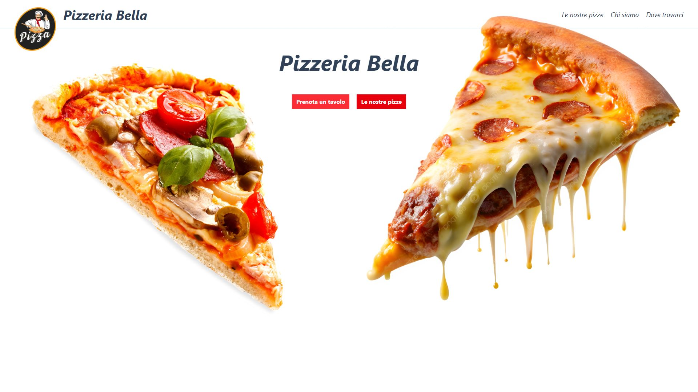
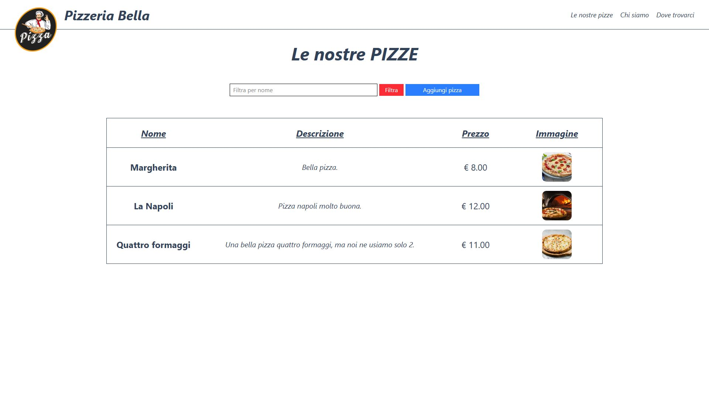
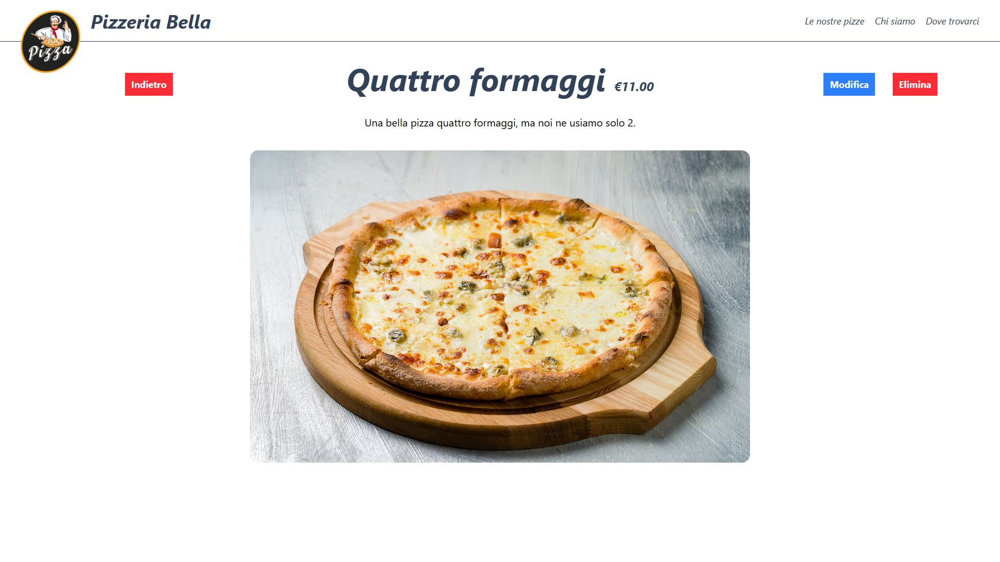

# 📦 Pizzeria Bella

🍕 **Pizzeria Bella** è un'applicazione web per la gestione del menu di una pizzeria. L'app consente di:

- 📋 Visualizzare l'elenco delle pizze disponibili
- ➕ Aggiungere nuove pizze al menu
- ✏️ Modificare i dettagli delle pizze esistenti
- ❌ Rimuovere pizze dal menu

Utilizza un database MySQL in locale per memorizzare le informazioni relative alle pizze, inclusi nome, ingredienti e prezzo.

💻 Sviluppato con:

- Java
- Spring Boot (backend)
- Thymeleaf (frontend)
- MySQL (database)
- HTML, CSS, JavaScript (interfaccia utente)

# 📸 Screenshots

